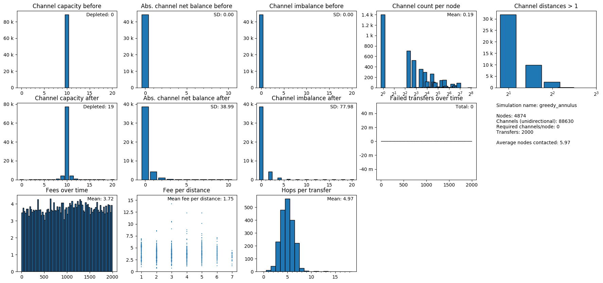

# Raiden Network Simulation


## Overview

This repository features two main scripts in the `bin/` directory:
* `simulate.py`
* `animate.py`

These scripts allow extensive testing of various kinds of network growth and routing models.


## Installation

```
virtualenv env
env/bin/pip install -e .
```


## Scripts

### `bin/simulate.py`

The `simulate.py` script contains a highly configurable description of the network growth, fee, and routing models to be used in two types of simulations:
* `simulate_scaling`
* `simulate_routing`

Results of both simulations are saved in the `out/` directory as a series of `.gif`s and `.png`s in timestamped subdirectories.

A single run of this script may evaluate several different routing models, as defined in `routing_strategies`. You can directly configure the exact mode of these simulations in `simulate.py:run()`

For detailed information on how to configure a network, please see the in-code documentation.


#### `simulate_scaling`

This simulation is intended for evaluating a network model with respect to transfer success rate, fees, number of hops, and channel degradation over time.

The scaling simulation performs many transfers over a network of the given description. A limited number of transfer failures are recorded and rendered as a `.gif` for easy debugging. Additional metrics collected include channel imbalance, transfer failures over time, channel distribution, etc.

Transfer crediting is optional, meaning that this simulation can be run without crediting actual transfer values. This may be useful if the intent is to merely evaluate several routing models without testing for network degradation.




#### `simulate_routing`

This simulation gives a more detailed view of individual routing attempts. Each attempt of routing a transfer through the network is recorded step by step and rendered both in a `.gif` as well as a series of `.png`s. Visited nodes are highlighted in the individual frames to illustrate possible backtracking.

Using this simulation only makes sense if the network is small enough to be rendered. Make sure to skip this step if you are testing for more than, say, 10,000 nodes, as rendering the network may take a long time and you probably end up with a grey blob.


### `bin/animate.py`

This script generates animation data that can be read by the `blender/*` scripts to be imported in Blender.

The background video on https://raiden.network/ was created using this script.


#### Create simulation data.
1. Configure the constants in `bin/animate.py`.
1. Run

        env/bin/python bin/animate.py

1. Check for files `blender/network.json` and `blender/animation.json`.

#### Import simulation data into Blender

1. Edit `blender_setup.py` with a global path to the simulation `blender` directory and copy its contents.
1. Configure `blender/settings.py`
1. Create a new blender project.
1. Open a `Python Console` editor.
1. Paste and execute the contents of (1).
1. Execute

        run_all()

   in Blender's Python console.

#### Blender Python commands

| Command | Effect |
| --- | --- |
| `reload_modules()` | Reloads the import modules. Required after changes to the `settings.py` or any of the scripts in `blender/`. |
| `blender_import.run()` | Imports network model data from `network.json`. |
| `blender_shade.run()` | Creates the shader setup for the visualization. Existing shader node groups will be kept. |
| `blender_animate.run()` | Imports the animation data from `animation.json` and registers it with the frame handler. |
| `run_all()` | Does all of the above |


#### Shaders

The `blender_shade.run()` script creates a single material for each element in the network, i.e., for every node and channel.

These materials use shaders from the Cycles rendering engine. Changes to these materials will be lost on reimport. However, all elements of a certain type (node or channel) share several shader node groups that can be configured:

| Node group | Responsibility |
| --- | --- |
| Default | The default appearance of a network element if it is visible. |
| Active | The appearance of a network element that is currently part of a transfer. It takes as input the color of the current transfer as specified in `blender/settings.py`. |
| Hidden | The appearance of a hidden, i.e. in the simulation non-existing, channel element. This is expected to be a simple transparency shader. |
| Curves | The three node groups above are mixed using two mixers to create the final appearance of a network element. The animation script linearly interpolates animations between their two states. The curve node group can be used to map this linear interpolation to a different curve. The R channel of the curve editor maps the show and hide animations. The G channel maps the flash animation.
